# SDN Port Status Monitoring Tool

## Problem Statement

The goal of this project is to build an SDN-based port health monitoring solution using the POX controller and Mininet. The tool specifically detects, logs, and alerts on switch port status changes (Up/Down events) while maintaining a functional learning switch behavior through explicit OpenFlow rules

This approach demonstrates how Software Defined Networking can be used not only for forwarding, but also for operational visibility, fault detection, and functional validation of a small network topology inside an Ubuntu virtual machine.

Key Objectives:

- Controller-Switch Interaction: Managing real-time communication between the POX controller and Open vSwitch.
- Flow Rule Design: Implementing match-action logic to handle `packet_in` events and install explicit flows.
- Network Behavior Observation: Monitoring port failures and measuring performance metrics.

## Topology and Setup

### Topology Justification

I used a Single Topology with 3 Hosts connected to 1 Switch (`--topo=single,3`). This setup provides a clear environment to demonstrate port status changes on a per-host basis while allowing for multi-path testing (e.g., h1 to h2 vs. h2 to h3).

### Environment Preparation

1. Create and activate the virtual environment named `sdn_env`.
2. Ensure the Python 3.12 compatibility bridge is available in the Ubuntu VM so the POX runtime can execute correctly under the expected interpreter path.
3. Updated Ubuntu packages and installed Mininet.
    `sudo apt update && sudo apt install mininet -y`

### Run the Controller

Start the POX controller application with the port monitoring module:

```bash
python3 pox.py port_monitor
```

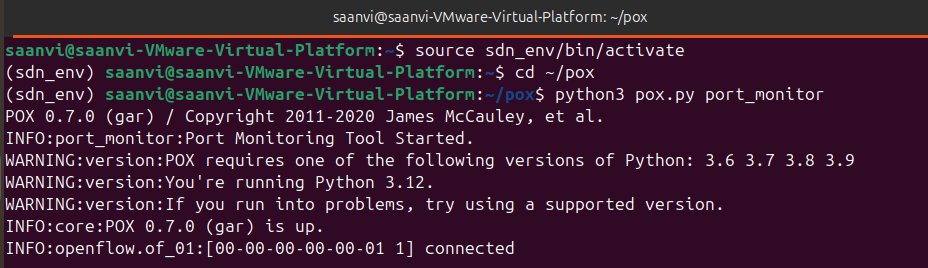

### Run Mininet

Launch Mininet with a remote controller and a single-switch, three-host topology:

```bash
sudo mn --controller=remote,ip=127.0.0.1 --topo=single,3
```
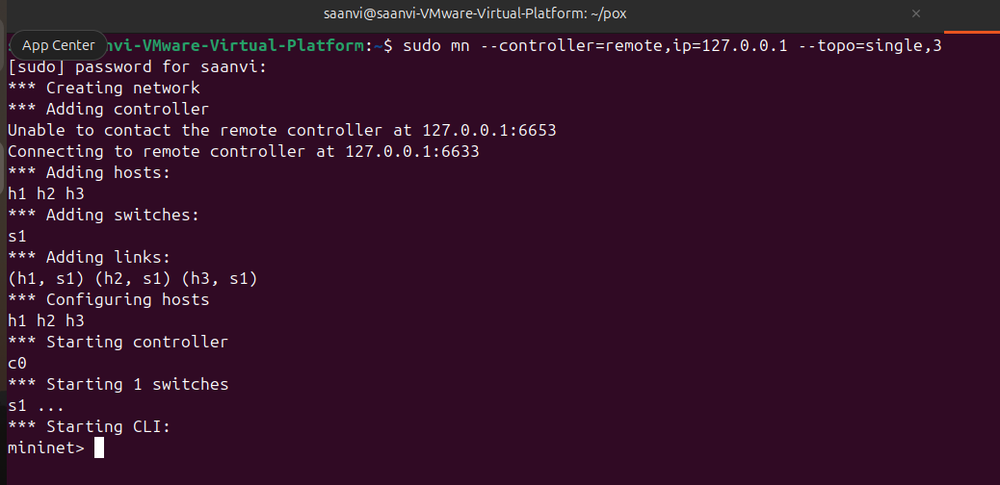

## SDN Logic & Implementation

The controller handles packet_in events by learning source MAC addresses and installing explicit flow rules to the switch.
- Match: Ethernet Source and Destination MAC addresses.
- Action: Output to the learned physical port.

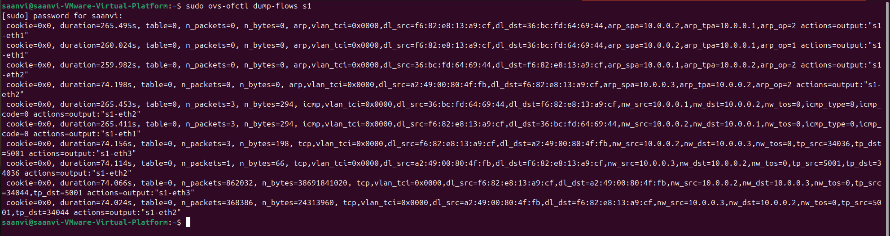

This screenshot proves the "match-action" rules are correctly installed in the switch.

## Test Scenarios & Expected Output

### Scenario 1: Normal vs. Failure

When the link between `s1` and `h1` is taken down, the controller should detect the port state change and print a clear alert.

- Command: `link s1 h1 down`
- Observation: The controller immediately detected the `PortStatus` event and generated a log alert.

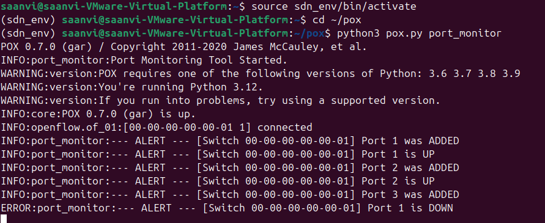

- Command: `link s1 h1 up`

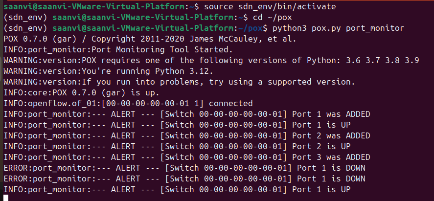

### Scenario 2: Allowed vs. Blocked

- Allowed: Verified connectivity with `pingall` while ports were active

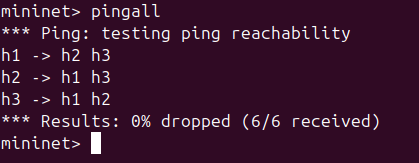

- Blocked: Verified that traffic to `h1` failed after the port was disabled

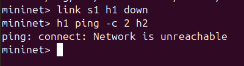


## Performance Observation & Analysis

To analyze network behavior, I measured latency and throughput.
- Latency (Ping): Verified low-latency communication during normal operation.

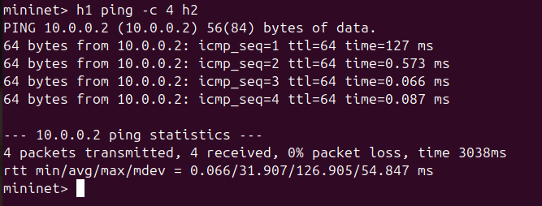

- Throughput (iperf): Measured the bandwidth between h1 and h2

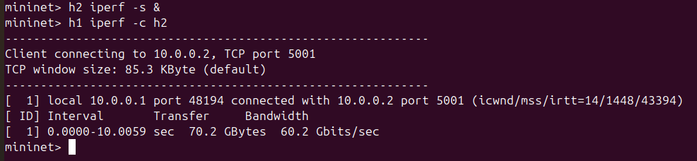
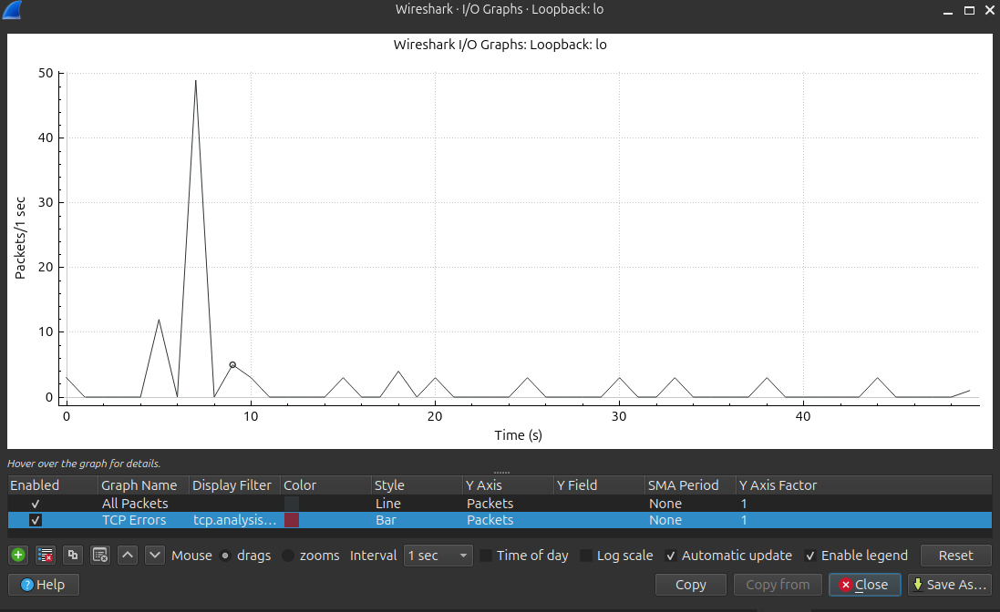
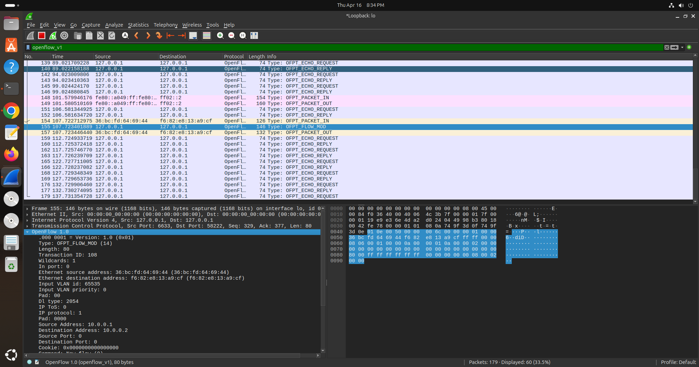

## References

[1] PES University Course Material: SDN Mininet Student Guidelines 

[2] Mininet Installation Manual on Ubuntu.

[3] POX Controller Documentation (https://noxrepo.github.io/pox-doc/html/).


## Project Notes

The project is designed to be simple enough for lab demonstration, yet representative of a practical SDN operations use case. It shows how a controller can provide both automated forwarding decisions and operational visibility from a single logic path.
